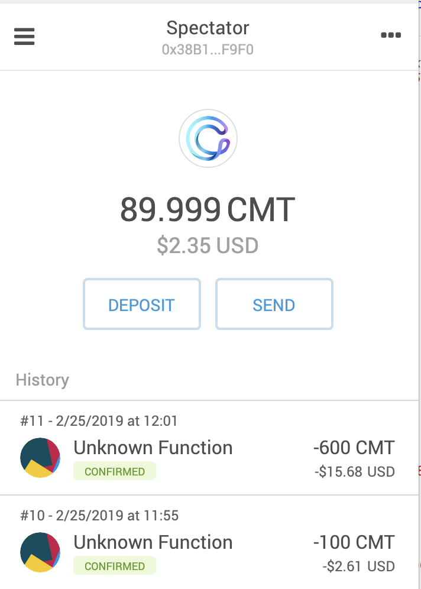

## Technical operation

### Deploying smart contract

We deploy the contract by passing in the fee-taker’s address. The fee-taker receives ½ of one percent for ticket purchases and refunds. The revenue taker is the event organizer. The fee taker and the revenue taker can not be the same CyberMiles address. Ticket sales revenues are stored in the smart contract and can be removed by the event organizer. Fees are transferred to the fee-taker’s address in real-time and are non refundable.


### Initializing the smart contract

The start and end time of the event are in epoch timestamp format. The ticket price is in CMT (converted to Wei by the smart contract).


### Testing - Frontend code examples

We can test the smart contract using frontend code examples. Firstly we copy the abi and address from Remix where the contract was deployed. We then perform the following web3 commands. 

#### Function 1 - Purchase single ticket 

Instantiate the contract instance
```
var contract = web3.eth.contract(abi).at(address);
```
Perform the purchase of a single ticket
```
contract.purchaseSingleTicket.sendTransaction({from:web3.eth.accounts[0], value: 100000000000000000000, gas:1000000}, function (error, result) { if(!error) { console.log(result); } else { console.log(error); } });
```
We can view this result in the code
```
var receipt = web3.eth.getTransactionReceipt("0x95e14791f1bf00e237d194a8ceba59634bebf57c147271870eb6dc521052cb81", function (error, result) { if(!error) { console.log(result); } else { console.log(error); } });
```
We can also view [this result](https://testnet.cmttracking.io/tx/0xa457791380c8b437d8dba606067b8db31b7fa98af3d9b9db42d1cf8d473b288d) in the cmttracker

#### Function 2 - Purchase Multiple Tickets

Perform the purchase of multiple tickets (in this case 6 tickets at 100 CMT each)
```
contract.purchaseMultipleTickets.sendTransaction(6, {from:web3.eth.accounts[0], value: 600000000000000000000, gas:400000}, function (error, result) { if(!error) { console.log(result); } else { console.log(error); } });
```
We can view this result in the code
```
var receipt = web3.eth.getTransactionReceipt("0x0130402d75a1aee14acc1d4e200c199c912181f08e29b7db096fe9716371bf0c", function (error, result) { if(!error) { console.log(result); } else { console.log(error); } });
```
We can also view this code [in the cmttracker](https://testnet.cmttracking.io/tx/0x0130402d75a1aee14acc1d4e200c199c912181f08e29b7db096fe9716371bf0c
)

Gas used to buy 6 tickets = 143497

As you can see, our spectator account has purchased a total of 7 tickets; one for 100 CMT and then a batch of another 6 for 600 CMT (100 CMT each).



We repeated the above transactions again (1 ticket, 6 tickets). You can now see these 4 transactions in the contract’s cmttracker page.


