# The Betting Game

The betting game allows multiple parties to bet on several potential outcomes through a smart contract. The contract creator
sets up the choices, and specifies the "correct" choice to end the game. The participants who betted on the correct choice
will divide the entire betting pool proprotional to their bets.

## Example in Remix

You will need to install Metamask for CyberMiles: https://www.cybermiles.io/metamask/ and then use Remix for CyberMiles to compile, deploy, and interact with the contract: http://remix.cybermiles.io/

### Deploying the contract

First, let's use the Admin Account to deploy the BettingGame contract. 
You should pass in the description of the bet and
the number of potential choices in this function call. In this case, our bet is whether the
CMT price can reach $1 in 2018. There are two betting choices, 0 is for NO and 1 is for YES.
It will cost some gas.
Once it is successfully deployed, the contract will have an address on the blockchain.

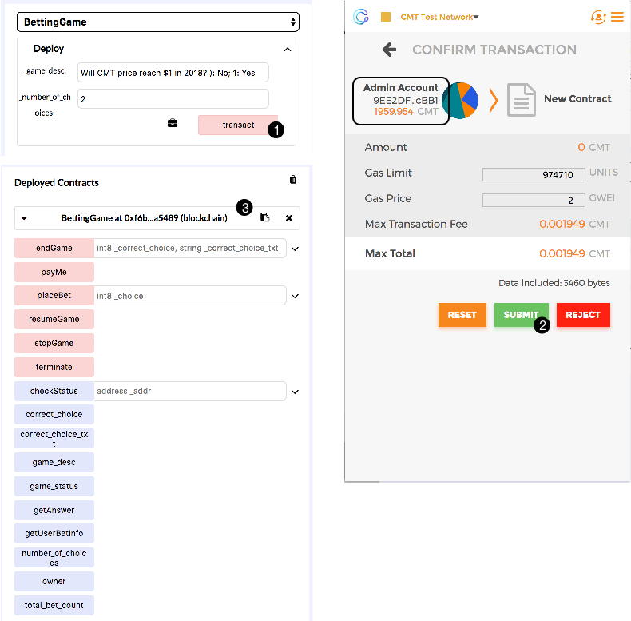

### Placing bets

Next, let's switch to account User A and bet on the NO choice. He will call the `placeBet` function
and pass in the choice as a parameter, and then pass in the bet amount (100 CMTs) 
as value of the transaction.

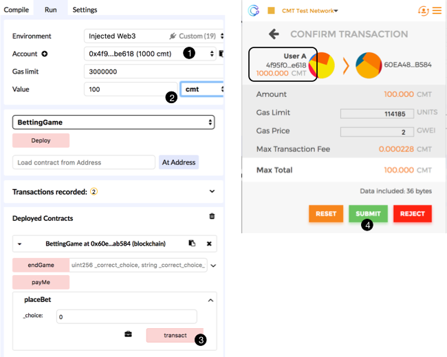

Then, swtich to account User B and bet on the YES choice. Again, he calls the `placeBet` function
with a CMT value (100 CMTs) in the transaction.

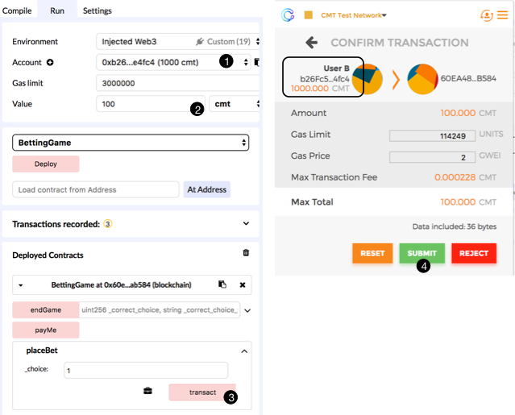

The contract creator (the Admin Account) can call the `stopGame` function at anytime to stop the betting, and call the `resumeGame` function to resume it.

### Declaring winners

The betting finishes when the contract creator (the Admin Account) calls the `endGame` function, and
pass in the correct choice.

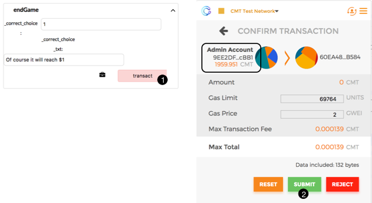

### Getting paid

Having won the bet, User B can now call the `payMe` function and get paid 200 CMTs.

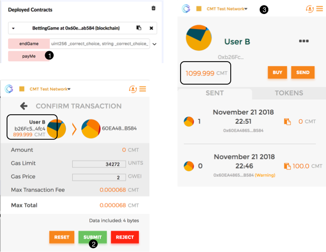

If User A calls the `payMe` function, the transaction would fail since User A did not win.

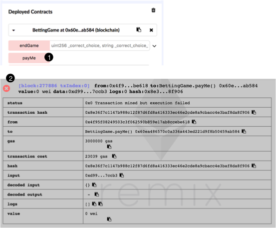

## Example in the HTML DApp and Metamask

### Deploying the contract

Please use Remix or the Travis client deploy the contract. Note the address of the deployed contract.

### Starting the game

Load the URL below in Chrome to create a new contract.

https://cybermiles.github.io/smart_contracts/SimpleBet/dapp/betting/simplebet_start.html

Next, you can fill in the question and choices to bet on! Use Metamask
to pay for the gas. 

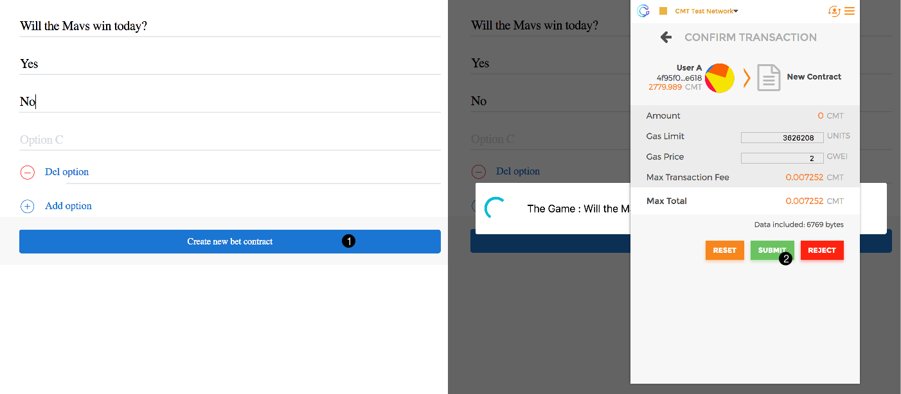

When you are done, you will be redirected to the betting page. You can place a bet here and can share
the link with anyone who is interested.

https://cybermiles.github.io/smart_contracts/SimpleBet/dapp/betting/simplebet_join.html?contract=0xContract_Addr

### Placing bets

Users who wish to place a bet can load the above web page.

https://cybermiles.github.io/smart_contracts/SimpleBet/dapp/betting/simplebet_join.html?contract=0xContract_Addr

Each user can now bet. Each user can only bet once.

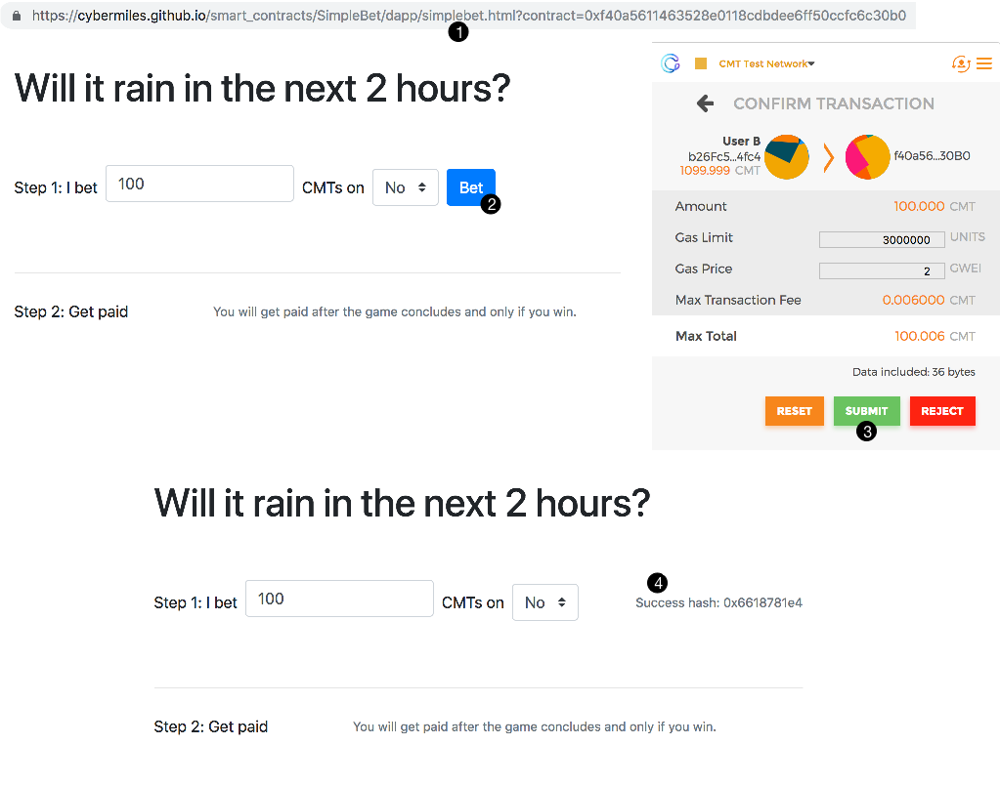

### Declaring winners

When the contract creator (owner) loads the bet page (the `simplebet_join.html`), he or she
will see a Settings button in addition to the Bet button. He or she
can declare winners through the Settings button.

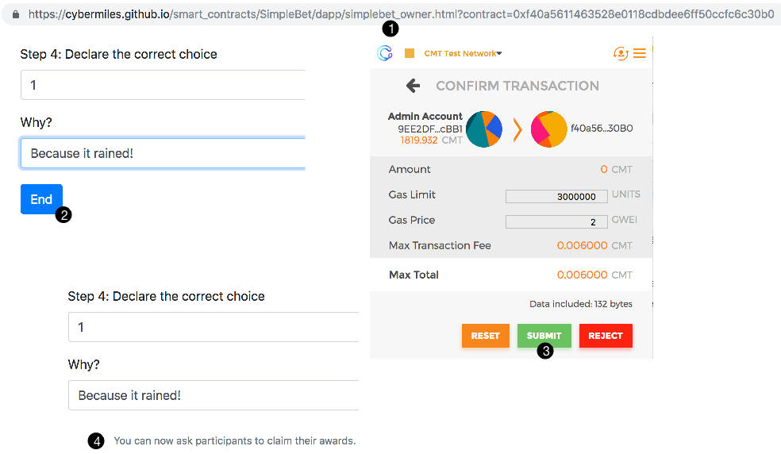

### Getting paid

Having won the bet, User A can now go back to the betting page and get paid CMTs.

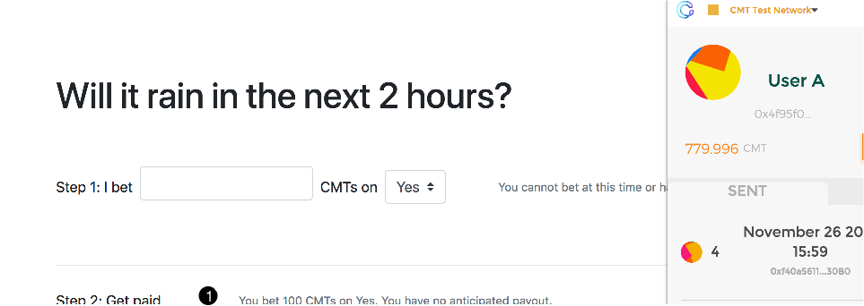

The payment option is not available to user B if the metamask account is set to B when the betting page is loaded.

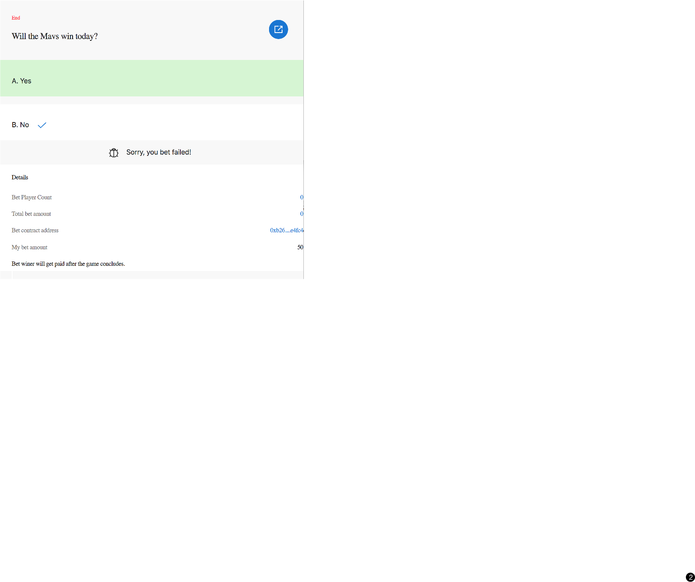

