# The Betting Game

The betting game allows multiple parties to bet on several potential outcomes through a smart contract. The contract creator
sets up the choices, and specifies the "correct" choice to end the game. The participants who betted on the correct choice
will divide the entire betting pool proprotional to their bets.

## Example in Remix

You will need to install Metamask for CyberMiles: https://www.cybermiles.io/metamask/ and then use Remix for CyberMiles to compile, deploy, and interact with the contract: http://remix.cybermiles.io/

First, let's use the Admin Account to deploy the BettingGame contract. It will cost some gas.
Once it is successfully deployed, the contract will have an address on the blockchain.

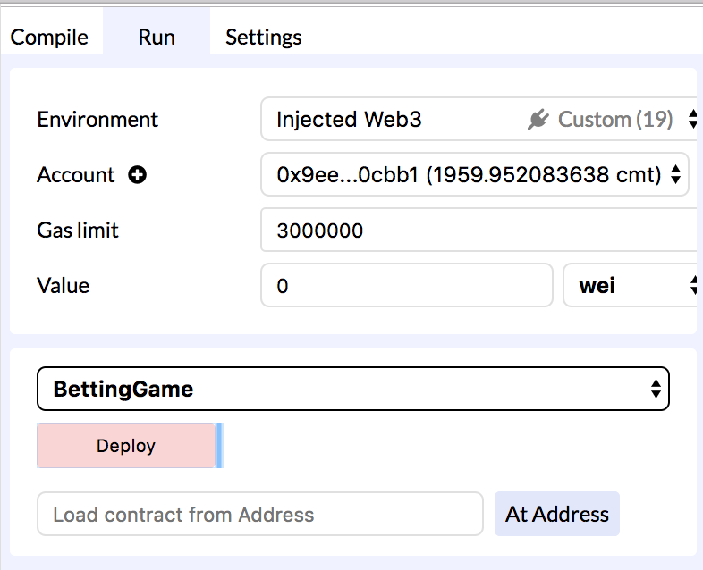
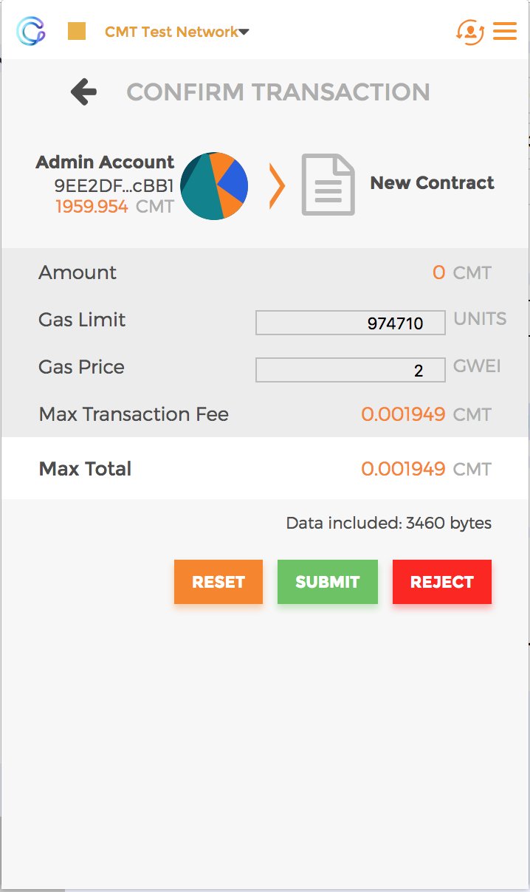
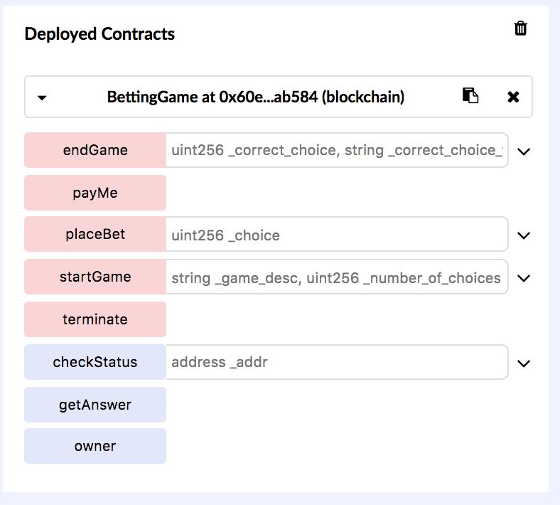

Once the contract is created, the Admin Account can initiate the betting game by calling the 
`startGame` function on the contract. You should pass in the description of the bet and
the number of potential choices in this function call. In this case, our bet is whether the
CMT price can reach $1 in 2018. There are two betting choices, 0 is for NO and 1 is for YES.

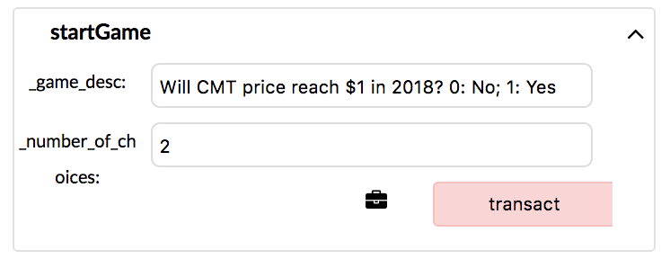
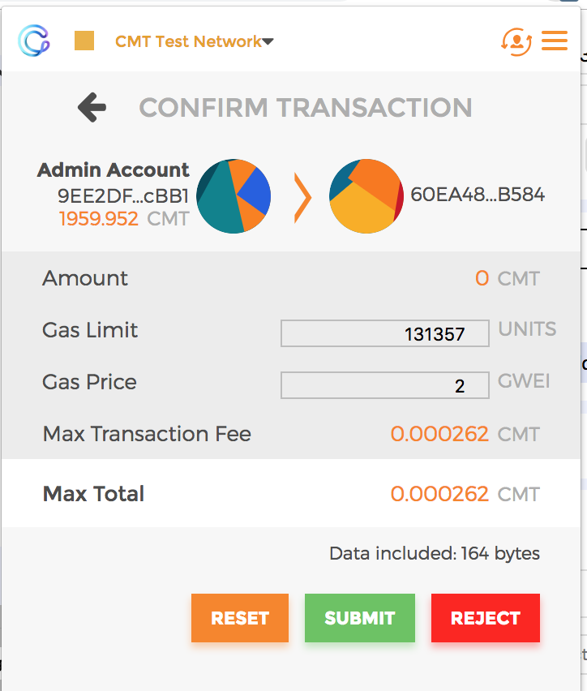

Next, let's switch to account User A and bet on the NO choice. He will call the `placeBet` function
and pass in the choice as a parameter, and then pass in the bet amount (100 CMTs) 
as value of the transaction.

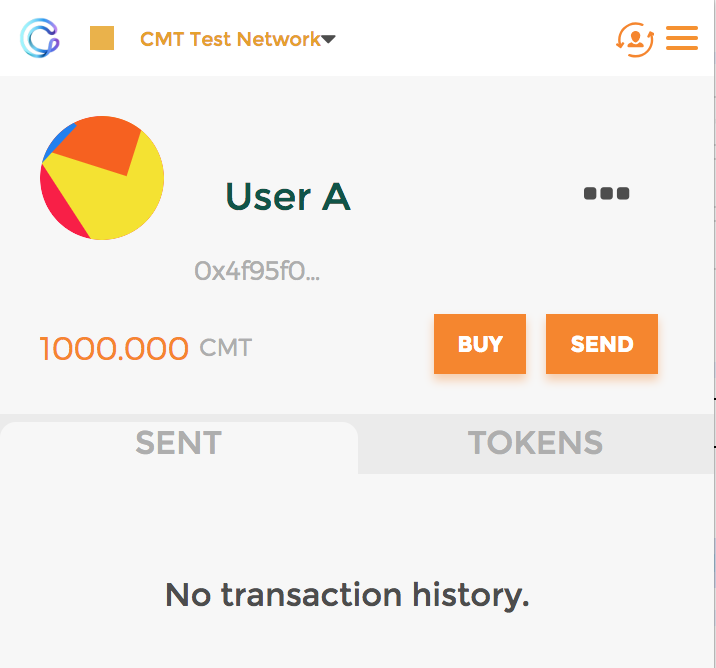
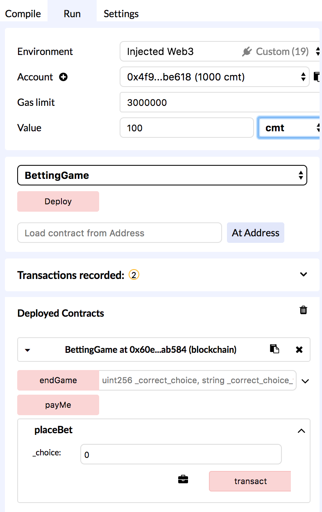
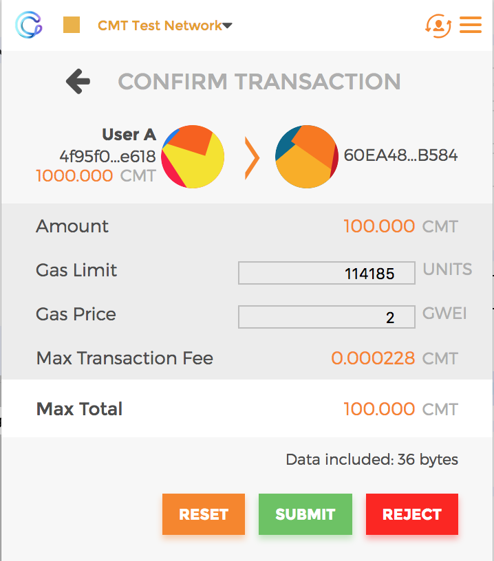

Then, swtich to account User B and bet on the YES choice. Again, he calls the `placeBet` function
with a CMT value (100 CMTs) in the transaction.

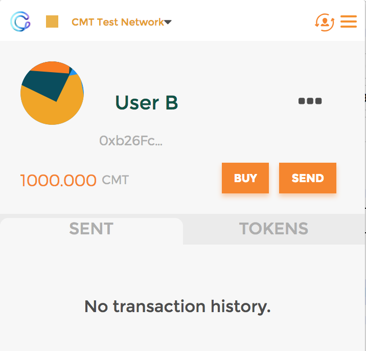
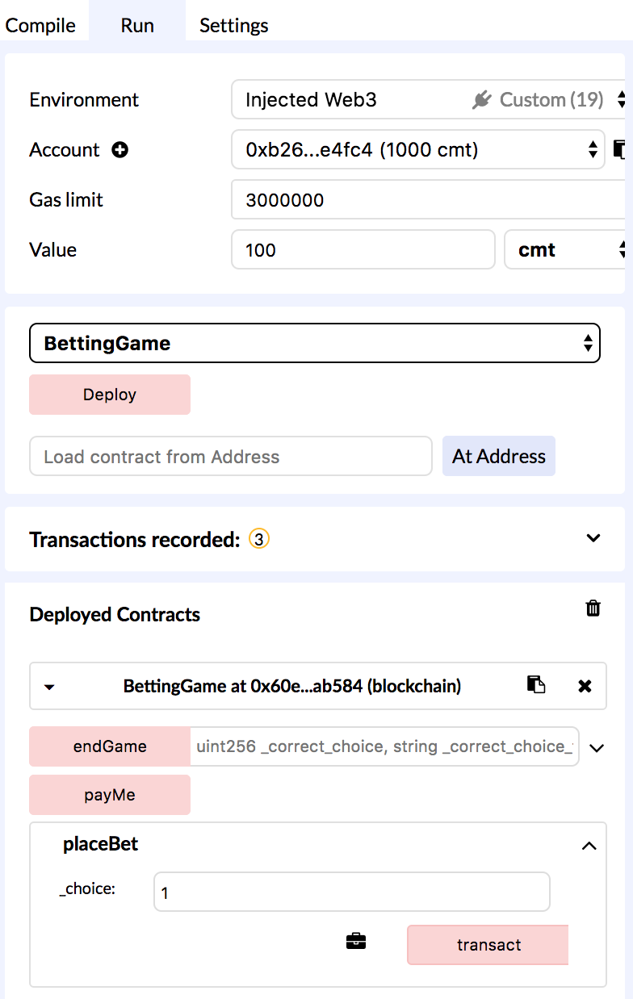
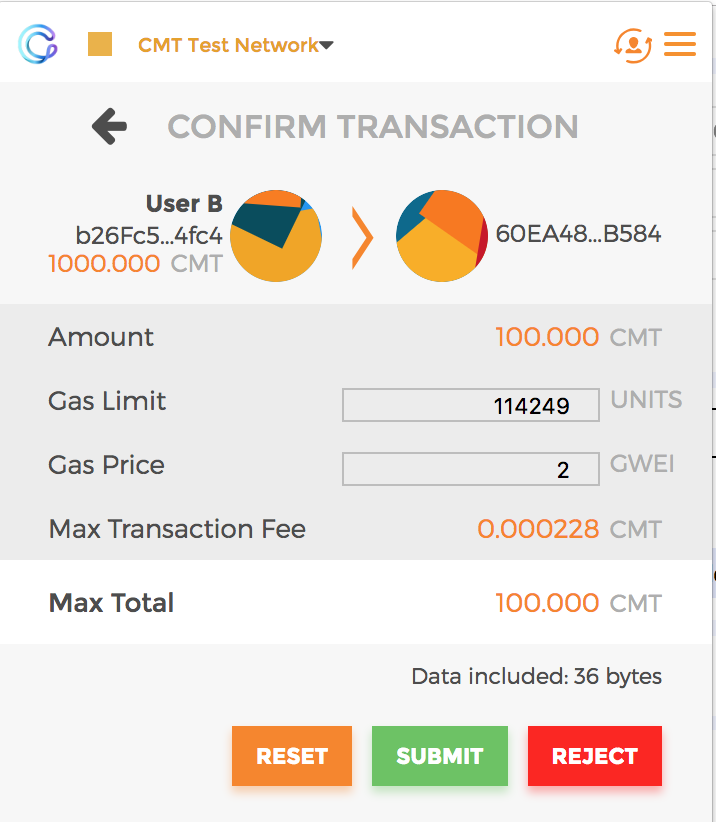

The betting finishes when the contract creator (the Admin Account) calls the `endGame` function, and
pass in the correct choice.

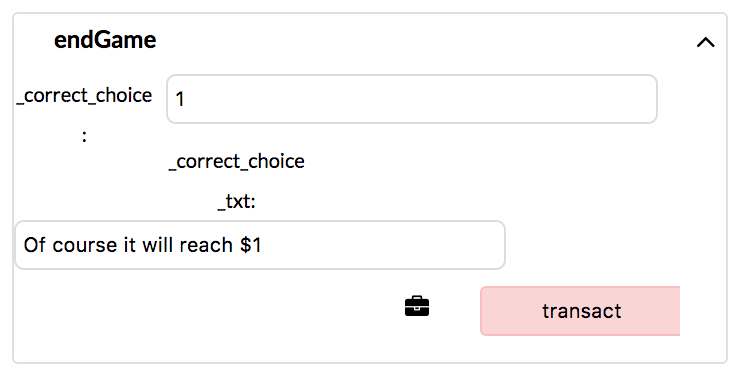
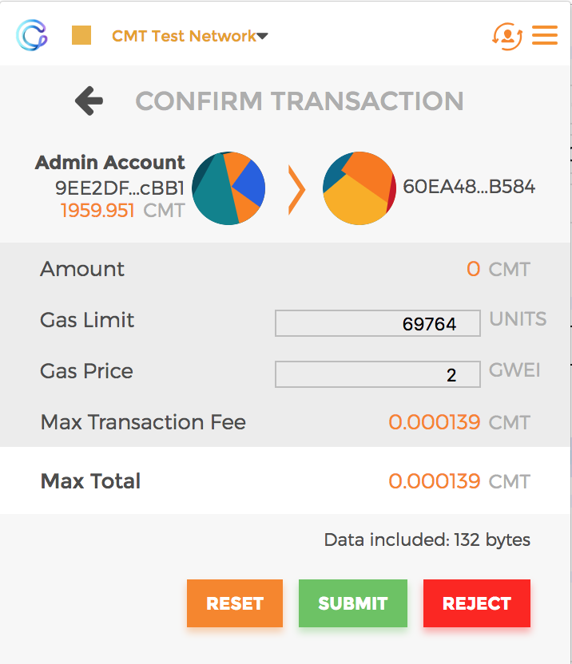

Having won the bet, User B can now call the `payMe` function and get paid 200 CMTs.

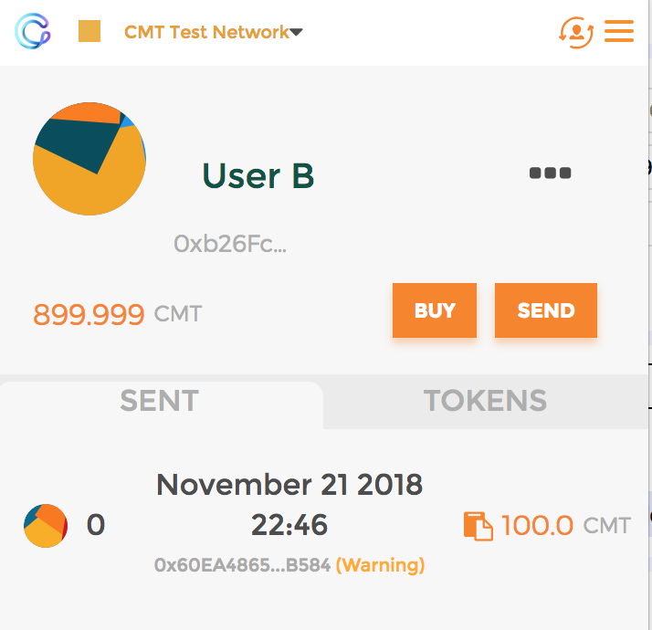
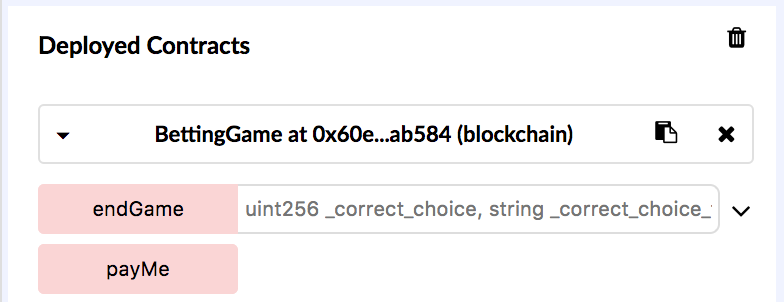
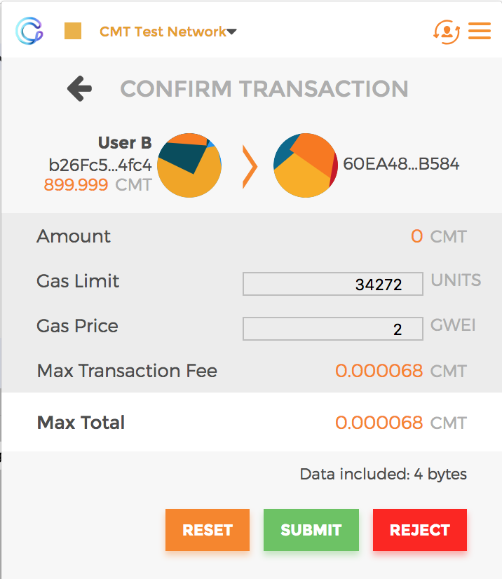

If User A calls the `payMe` function, the transaction would fail since User A did not win.

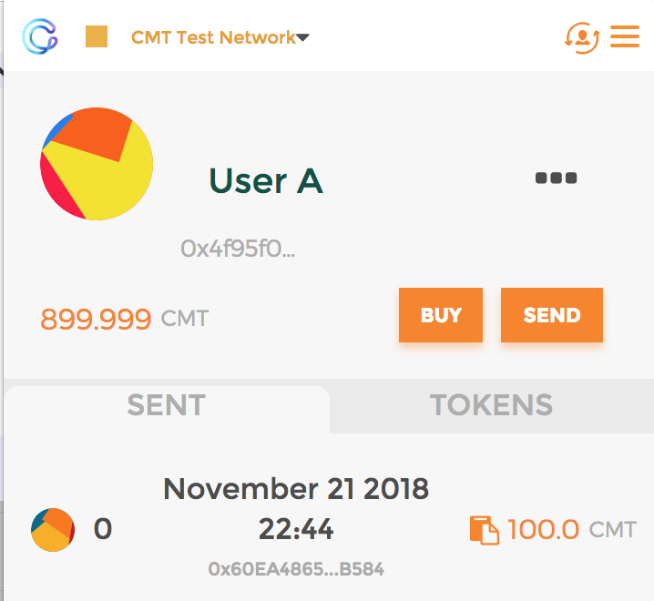

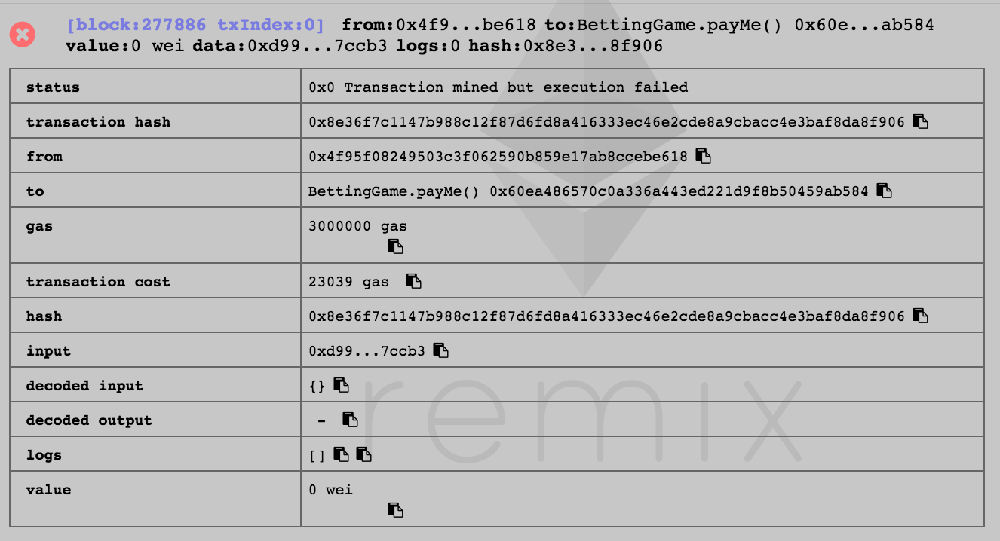

