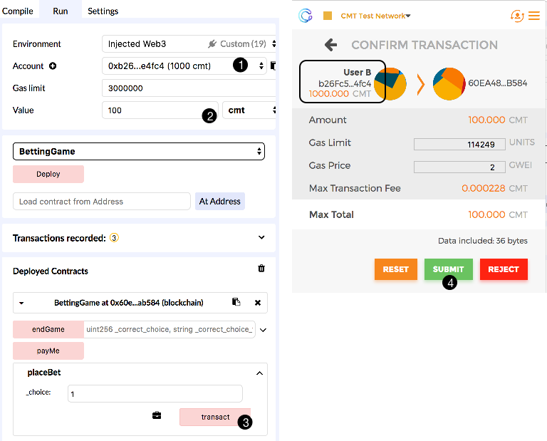
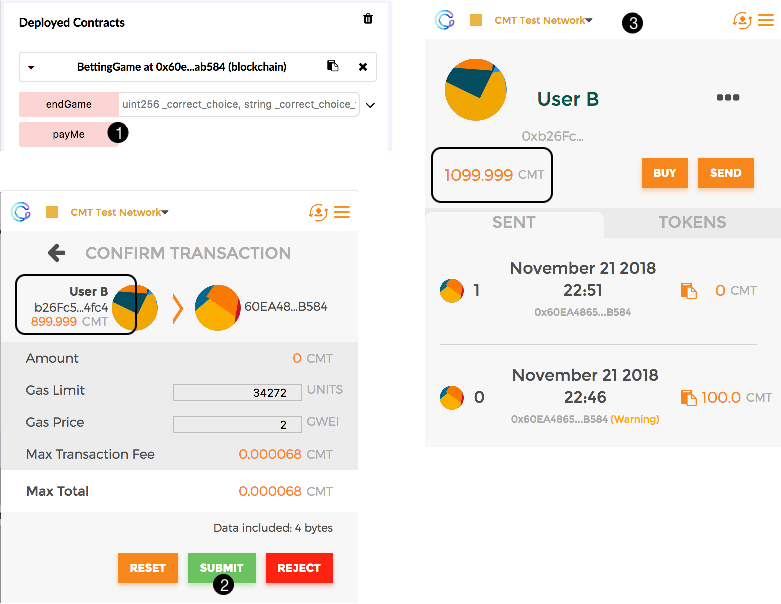
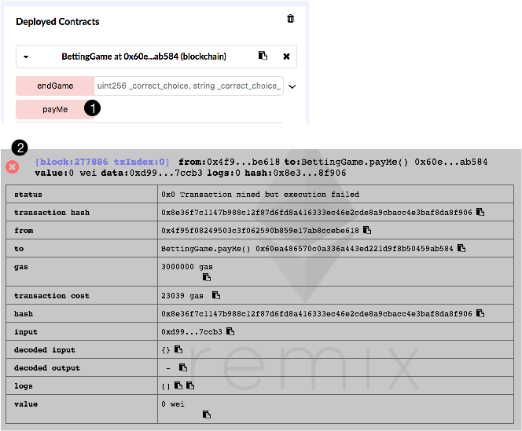
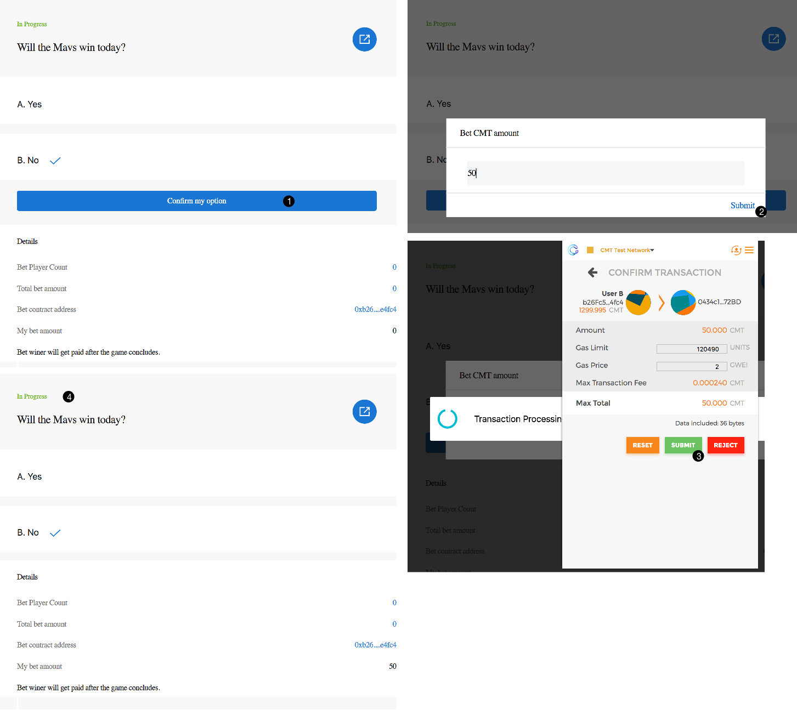
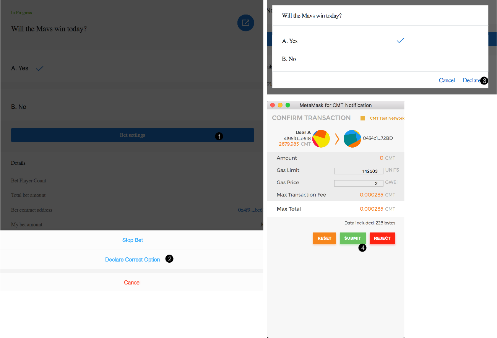
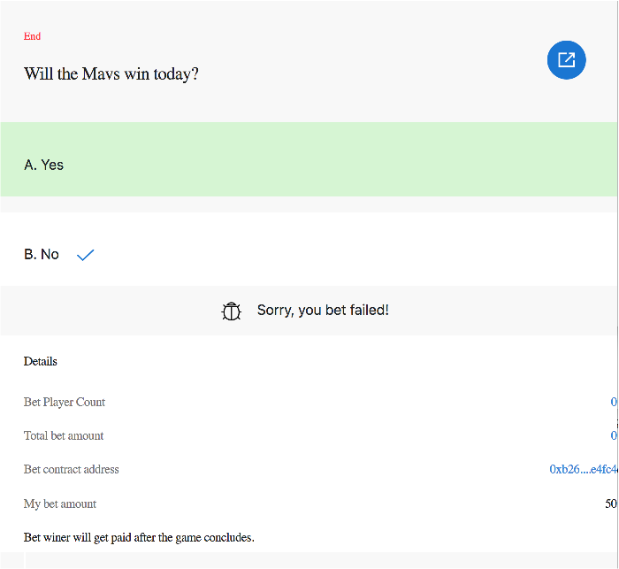
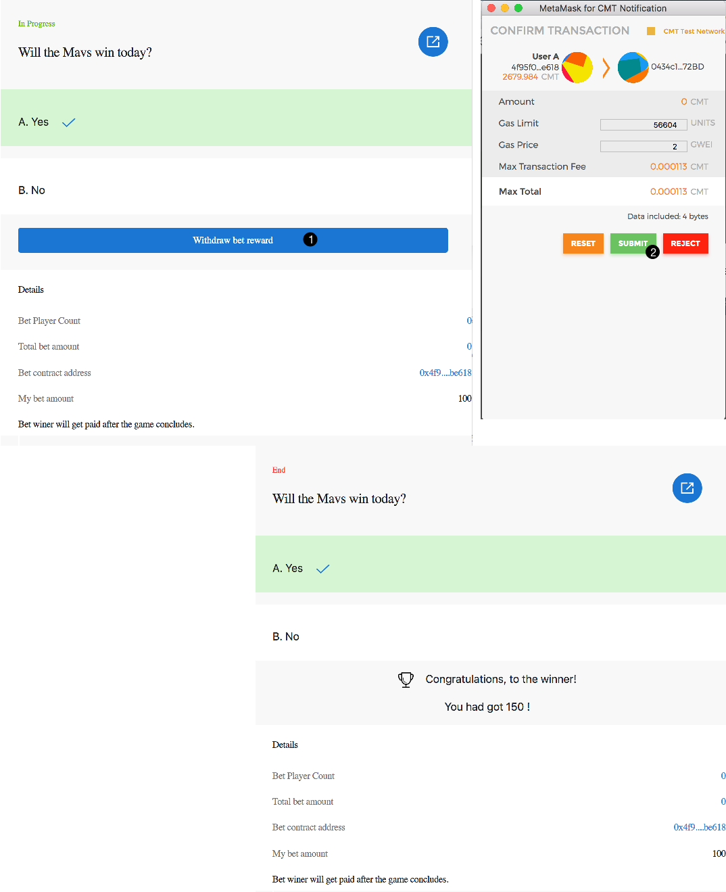

# The Betting Game

The betting game allows multiple parties to bet on several potential outcomes through a smart contract. The contract creator
sets up the choices, and specifies the "correct" choice to end the game. The participants who betted on the correct choice
will divide the entire betting pool proprotional to their bets.

## Example in Remix

You will need to install Metamask for CyberMiles: https://www.cybermiles.io/metamask/ and then use Remix for CyberMiles to compile, deploy, and interact with the contract: http://remix.cybermiles.io/

### Deploying the contract

First, let's use the Admin Account to deploy the BettingGame contract. It will cost some gas.
Once it is successfully deployed, the contract will have an address on the blockchain.

### Starting the game

Once the contract is created, the Admin Account can initiate the betting game by calling the 
`startGame` function on the contract. You should pass in the description of the bet and
the number of potential choices in this function call. In this case, our bet is whether the
CMT price can reach $1 in 2018. There are two betting choices, 0 is for NO and 1 is for YES.

### Placing bets

Next, let's switch to account User A and bet on the NO choice. He will call the `placeBet` function
and pass in the choice as a parameter, and then pass in the bet amount (100 CMTs) 
as value of the transaction.

Then, swtich to account User B and bet on the YES choice. Again, he calls the `placeBet` function
with a CMT value (100 CMTs) in the transaction.

The contract creator (the Admin Account) can call the `stopGame` function at anytime to stop the betting, and call the `resumeGame` function to resume it.

### Declaring winners

The betting finishes when the contract creator (the Admin Account) calls the `endGame` function, and
pass in the correct choice.

### Getting paid

Having won the bet, User B can now call the `payMe` function and get paid 200 CMTs.

If User A calls the `payMe` function, the transaction would fail since User A did not win.

## Example in the HTML DApp and Metamask

### Deploying the contract

Please use Remix or the Travis client deploy the contract. Note the address of the deployed contract.

### Starting the game

Load the URL below in Chrome to load the admin UI of the contract. Your current active Metamask
account must be the same account where you deployed the contract (i.e., it is the contract owner).

https://cybermiles.github.io/smart_contracts/SimpleBet/dapp/simplebet_owner.html?contract=0xContract_Addr

Next, you can fill in the question and choices to bet on! Use the contract's owner account in Metamask
to pay for the gas.

### Placing bets

Users who wish to bet can load the following web page.

https://cybermiles.github.io/smart_contracts/SimpleBet/dapp/simplebet.html?contract=0xContract_Addr

Each user can now bet. Each user can only bet once.

### Declaring winners

Now back to the owner's UI page, the contract owner can stop the betting at any time. And he or she
can declare winners by declaring the correct answer.

### Getting paid

Having won the bet, User B can now go back to the betting page and get paid CMTs.

The payment option is not available to user A if the metamask account is set to A when the betting page is loaded.

