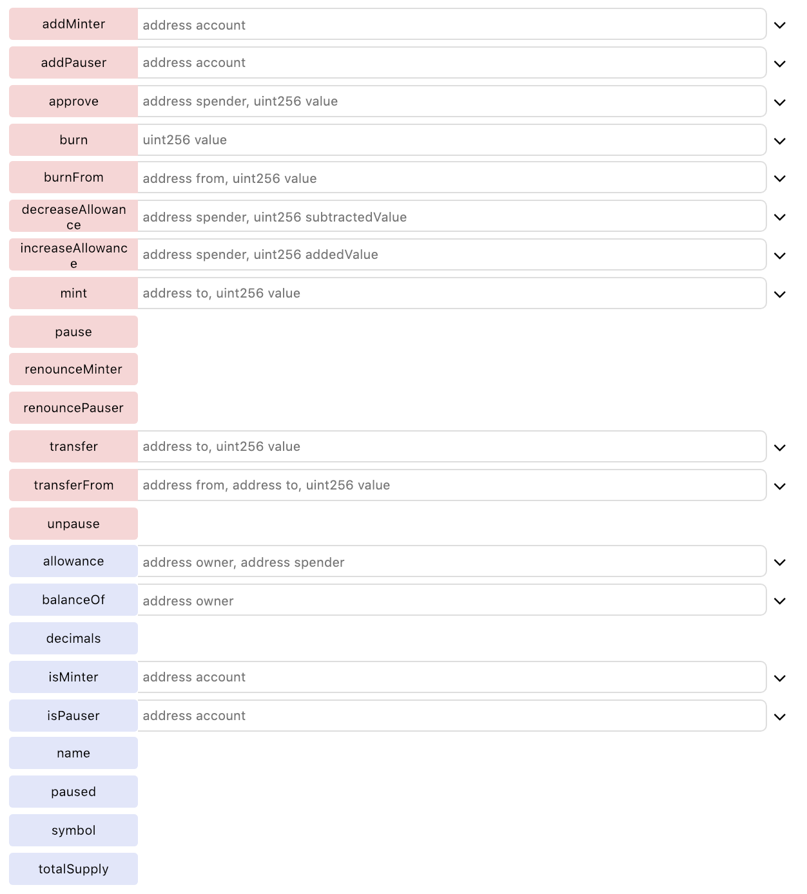

# CyberMiles Stable Coin Smart Contract

This stable coin smart contract (CMTD) is designed to work in conjunction with a payment gateway. At present the contract inherits 4 pre-existing contracts from [OpenZeppelin](https://github.com/OpenZeppelin/openzeppelin-solidity).

It was found that the following 4 OpenZeppelin contracts inherit from and implement a variety of contracts and libraries which in-turn provide sufficient functionality to implement the CyberMiles Stable Coin Smart Contract (CMTD).

Below is a quick overview of what all of the 4 inherited contract bring to the CMTD contract. The most significant functionality is the ability to mint and burn tokens as well as the ability to manage roles as apposed to the traditional method of just having the owner perform all of the administration functions (i.e. using the Ownable contract). 

Any additional functionality can now be added to the CMTD contract in the form of function overrides and/or additional modifiers.

## Mintable
The OpenZeppelin ERC20Mintable contract inherits from ERC20 and MinterRole. MinterRole subsequently implements the Roles Library. The Roles Library manages addresses which are assigned to a single role. Using the ERC20Mintable contract provides not only the ability to mint new tokens, but the ability to completely manage access control for one or more "minters" which are technically an instance of Roles.Role.

## Burnable
The OpenZeppelin ERC20Burnable contract inherits from ERC20. It has a function called burnFrom which allows a specific amount of tokens from the target address to be burned. The burning of tokens is on the proviso that an allowance to do so has been set.

## Pausable
The OpenZeppelin ERC20Pausable contract inherits from ERC20 and Pausable. Pausable inherits from PauserRole. PauserRole subsequently implements the Roles Library. The Roles Library manages addresses which are assigned to a single role, as we mentioned in the Mintable section.

## Detailed
The OpenZeppelin ERC20Detailed contract is IERC20 and simply provides an opportunity to enrich the contract with additional name, symbol and number of decimals for the token.

All in all, the above 4 contracts (and their inherited contracts and implemented libraries) provide the following functionality to the CMTD contract without any modification whatsoever. As mentioned any additional functionality can be created through the use of function overriding and/or additional modifiers.

## Functionality

## Supply
The CMTD contract is designed to have a variable supply. The initial supply is set to zero. Tokens minted will increase the supply and tokens burned will decrease the supply. The minting and burning of tokens will come about as a result of logic in the payment gateway.
