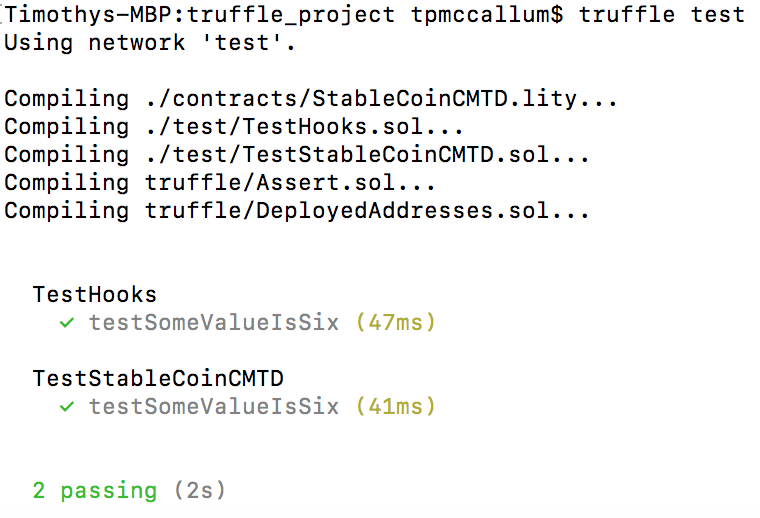

# CyberMiles Stable Coin Smart Contract Documentation

## Unit testing with Truffle

[Truffle with Lity support](https://github.com/CyberMiles/truffle) can be used to perform unit tests on the CMTD stable coin.

Download and install Truffle

```
cd ~
git clone https://github.com/CyberMiles/truffle.git -b lity
cd ~/truffle
npm install -g lerna yarn
npm run bootstrap
export PATH="$PWD/node_modules/.bin:$PATH"
```

Create a new environment
```
$ mkdir ~/truffle/truffle_env
$ cd ~/truffle/truffle_env
$ truffle init
$ truffle compile
```

Download the raw (flattened) source code of the CMTD stable coin
```
$ cd ~/truffle/truffle_env/contracts
wget https://raw.githubusercontent.com/CyberMiles/smart_contracts/master/StableCoin/StableCoinCMTD.lity
```
Copy [all of StableCoin tests](https://github.com/CyberMiles/smart_contracts/tree/master/StableCoin/tests) into the ```~/truffle/truffle_env/test``` directory.

### Run the unit tests on undeployed contracts
The following will perform unit tests on functions which are essentially pure or view i.e. the ones from our [tests directory](https://github.com/CyberMiles/smart_contracts/tree/master/StableCoin/tests) which we copied across earlier. See screen capture below.
```
cd ~/truffle/truffle_env
truffle test
``` 


### Truffle console - run tests directly against deployed Lity/Solidity contracts
The following steps can be carried out so that Truffle console can interact with a deployed smart contract.

- Step 1, install web3
```
npm install -i -g web3
```
- Step 2, configure Truffle console so that it can connect to the CyberMiles testnet
```
vi truffle-config.js
```
```
const web3 = require("web3");
```
```
module.exports = {
    networks: {
      testnet: {
        provider: () => new web3.providers.HttpProvider('https://testnet.cmtwallet.io:8545'),
        network_id: "*",
      }
    }
}
```
- Step 3, start the Truffle console
```
truffle console --network testnet
```
- Step 4, test the console
-- 4a
```
truffle(testnet)> CMTD.network_id
```
```
'19' // returns 19 which is the testnet.cmtwallet.io network id
```
-- 4b
```
truffle(testnet)> CMTD.contract_name
```
```
'CMTD' // returns CMTD
```
-- 4c
```
truffle(testnet)> CMTD.events
```
```
{ '0x62e78cea01bee320cd4e420270b5ea74000d11b0c9f74754ebdbfc544b05a258': 
   { anonymous: false,
     inputs: [ [Object] ],
     name: 'Paused',
     type: 'event' },
  '0x6ae172837ea30b801fbfcdd4108aa1d5bf8ff775444fd70256b44e6bf3dfc3f6': 
   { anonymous: false,
     inputs: [ [Object] ],
     name: 'MinterAdded',
     type: 'event' } ...
```
Create an instance of a deployed contract which was deployed using Remix
```
var dc = CMTD.at("0x627306090abaB3A6e1400e9345bC60c78a8BEf57")
```

#### Assert
Assert should be saved for internal invariants (reserved for an internal invariant which is assumed to always be true at run time).
Remaining gas is kept.
State conditions are rolled back to before code execution.

#### Require
The require function acts as a gate condition, preventing execution of the rest of the function and producing an error if it is not satisfied.[1]
Remaining gas is returned to the sender
State conditions are rolled back to before code execution.

#### Revert
The Revert function can also be used to prevent further execution but it can also produce an error message (taken as one of its arguments).


# References
[1] https://github.com/ethereumbook/ethereumbook/blob/develop/07smart-contracts-solidity.asciidoc


